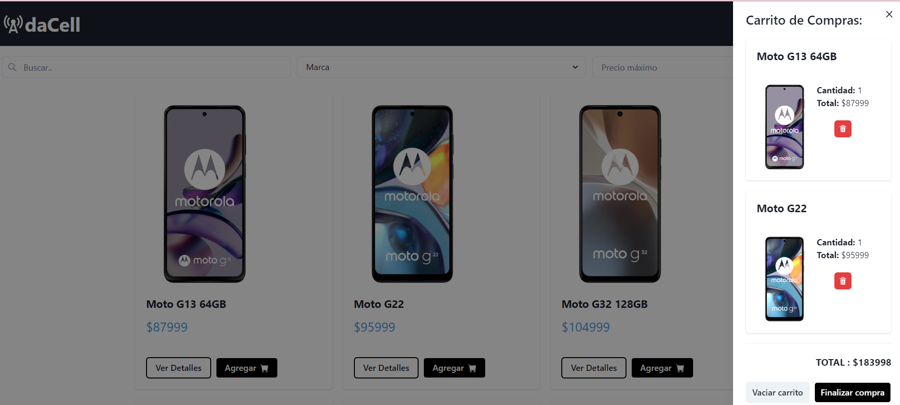

# Ecommerce Ada Cell 🛒📱
## Intro 📌

Este proyecto consiste una tienda virtual de celulares desarrollada con `JavaScript`, `ReactJS` y `Chakra UI`. 
La aplicación utiliza `Firebase` como base de datos para almacenar los productos y proporcionar autenticación para los usuarios. 
Permite a los usuarios crear una cuenta o acceder con su cuenta de Google. 
La tienda incluye un carrito de compras y la capacidad de ver los detalles de cada producto. 
Además, se utiliza `React Router Dom` para gestionar las rutas y `React Hook Form` para validar los formularios. 
También se han implementado rutas protegidas para ciertas funcionalidades.

## Herramientas y tecnologías 🛠️
Para realizar este proyecto se utilizaron diferentes herramientas y tecnologías:

- **JavaScript**: El lenguaje de programación principal utilizado en el desarrollo de la tienda virtual.

- **ReactJS**: Una biblioteca de JavaScript utilizada para construir interfaces de usuario interactivas y reutilizables.

- **Chakra UI**: Un conjunto de componentes de interfaz de usuario altamente personalizables y accesibles que se utilizan para diseñar la apariencia y la experiencia de la tienda.

- **Firebase**: Una plataforma de desarrollo de aplicaciones en la nube que proporciona una base de datos en tiempo real y servicios de autenticación. Se utiliza para almacenar los productos, gestionar la autenticación de los usuarios y realizar la compra de productos.

- **React Router Dom**: Una librería de enrutamiento utilizada para gestionar las rutas y la navegación en la aplicación.

- **React Hook Form**: Una librería utilizada para simplificar la validación de formularios en React.

## Vista Previa 👀

## Deploy 🚀
El proyecto está desplegado y disponible en línea. 
Puedes acceder a la tienda virtual de celulares a través del siguiente enlace:

👉🏼 [Ecommerce Ada Cell](https://ecommerce-ada.vercel.app/)
## Contacto 📤
Si tienes alguna pregunta o sugerencia, no dudes en contactarme a través de mi dirección de correo electrónico [samantar17@gmail.com].

¡Gracias por tu interés en esta tienda virtual de celulares! 🙌🏼
